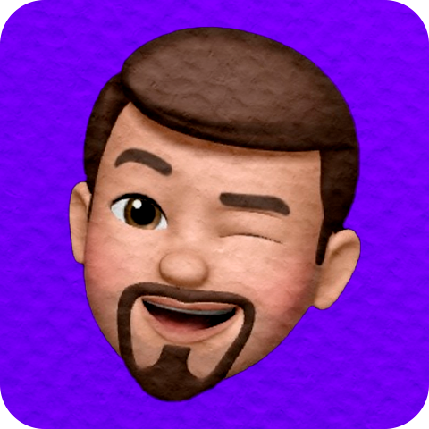

    
    

# **ALURA CHALLENGE FRONT-END - CODECHELLA**

    Este é o repositório do projeto <b>CodeChella</b> parte do Desafio "Alura Challenge Front-End - 6ª Edição.

 ## **Contatos e Links interessantes**
 

   
   
   
   
 

-------------------------------------------------

## **Informações do Projeto**
| :placard:  Vitrine.Dev |     |
| -------------  | --- |
| :sparkles: Nome        | **CodeChella**
| :label: Tecnologias | HTML, CSS
| :rocket: URL         | https://codechella-alura-challenge.vercel.app/
| :fire: Desafio     | Alura Chalenge 6ª Edição

----------------------------------------------

## **Resumo do Projeto**
Em linhas gerais o projeto visa a criação de um página web para um evento intitulado CodeChella, que recebe o usuário, apresenta como será o evento e sua programação e é capaz de redirecionar o usuário para detalhes específicos, como comprar um ingresso através de formulários. 
O projeto é dividido em semanas que vão adicionando camadas de estudos e responsabilidades com o código além do visual (HTML e CSS). 
A ideia é colocar em prática o conhecimento adquirido na Alura, implementar soluções criativas para questões relacionadas ao trabalho de um desenvolvedor front-end e adicionar o projeto ao portfólio de quem trabalha com ele (nesse caso é a pessoa que digitou esse README.md).

## **Detalhes das Semanas**
`SEMANA 01`
> Desenvolvimento do site, com páginas, principais e subpáginas, com HTML e CSS, com foco em responsividade para telas (mobile, tablet e desktop), preparação de ambiente para alternar cores (modo verão e inverno), HTML limpo para refatoração correta, foco no método B.E.M, a hierarquia de páginas é: 
  - Página Principal (que vai conter todos os direcionamentos necessários);
  - A Experiência (primeira subpágina);
  - Mapa de Setores;
  - Página de Informações Gerais;
  - Formulário de Compra dos Ingressos.
 

`SEMANA 02`
> Foco na responsividade do site, para ajustar as views de tablets e smartphones 
  - Modelo das Medias Querys;
  - Ajuste de proporção das imagens;
  - Resposividade das Imagens com SRCSET, propriedade HTML.
 

`SEMANA 03`
 
`SEMANA 04`

## **Prévia do Site**
### **TEMAS VERÃO**

**Desktop**

